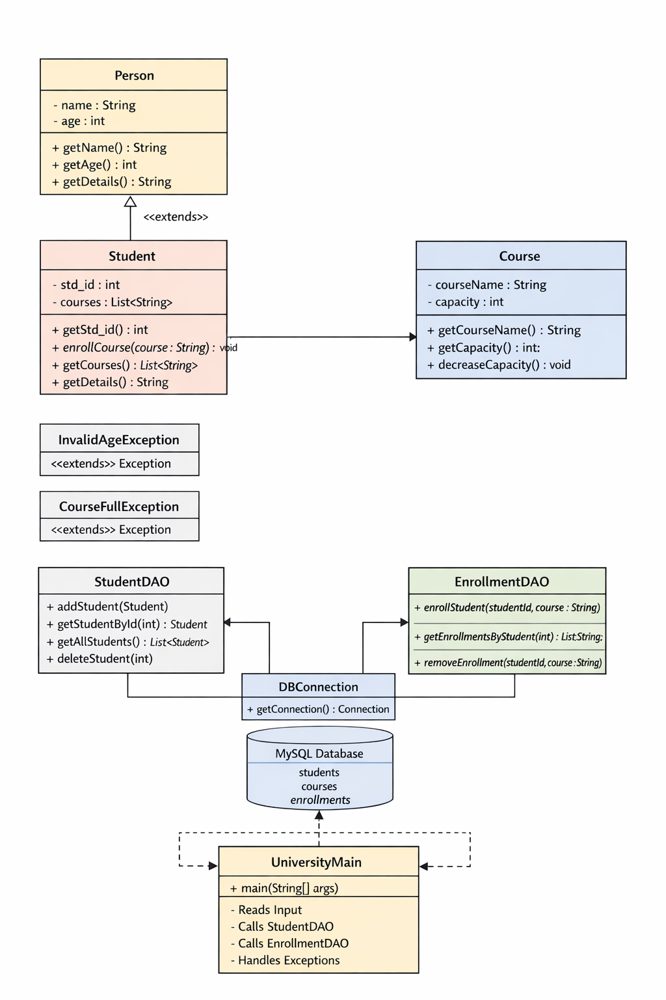
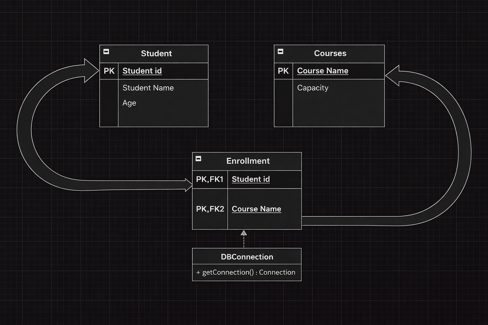
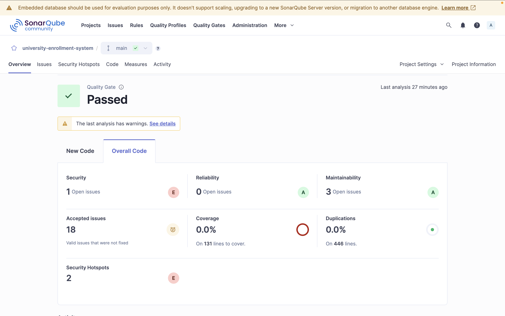

# University Enrollment System

A Java-based console application demonstrating Object-Oriented Programming (OOP), JDBC, MySQL database integration, DAO design pattern, custom exception handling, and static code quality analysis using SonarQube.

This project was developed to understand real-world backend architecture and software quality practices.

---

## 1. OOPS Architecture (UML Design)

The system is designed using core OOP principles:

- Inheritance: `Student` extends `Person`
- Encapsulation: Private fields with getters
- Abstraction: DAO layer hides database operations
- Exception Handling: Custom exceptions for business rules

### Class Diagram

### Key Components

- `Person` (Base Class)
- `Student` (Extends Person)
- `Course`
- `StudentDAO` (Database access for students)
- `EnrollmentDAO` (Handles enrollment logic)
- `DBConnection` (JDBC connection utility)
- Custom Exceptions:
    - `InvalidAgeException`
    - `CourseFullException`

---

## 2. Database Architecture (MySQL Schema)

Relational database design using normalization and foreign key constraints.

### Tables

- **Student**
    - student_id (PK)
    - name
    - age

- **Courses**
    - course_name (PK)
    - capacity

- **Enrollment**
    - student_id (PK, FK)
    - course_name (PK, FK)

### ER Diagram

This design ensures:
- Referential Integrity
- Many-to-Many relationship between Students and Courses
- Capacity control at database + application level

---

## 3. SonarQube Static Code Analysis

SonarQube was used to analyze the project for:

- Code Quality
- Maintainability
- Security Vulnerabilities
- Code Smells
- Technical Debt

### SonarQube Report

### Metrics Summary

- Quality Gate: **PASSED**
- Reliability: A
- Maintainability: A
- Security: Issues identified and reviewed
- Duplications: 0%
- Code Coverage: 0% (Tests skipped intentionally for JDBC focus)
- Security Hotspots: Reviewed

This demonstrates industry-level static analysis usage in a student project.

---

## 4. Technologies Used

- Java 21
- JDBC
- MySQL
- Maven
- SonarQube
- Git & GitHub

---

## 5. Design Patterns Used

- DAO (Data Access Object)
- Singleton (DB Connection Utility)
- Layered Architecture (UI → Service → DAO → DB)

---

## 6. Interview Talking Points

This project demonstrates:

- Strong OOP fundamentals
- Real database connectivity using JDBC
- Exception-driven business validation
- Separation of concerns using DAO
- Code quality evaluation using SonarQube
- UML & ER diagram driven design
- Industry-style tooling and workflow

---

## Author

Rudra Mishra  
Java Backend Developer (Fresher)  
GitHub: https://github.com/rudra2955
